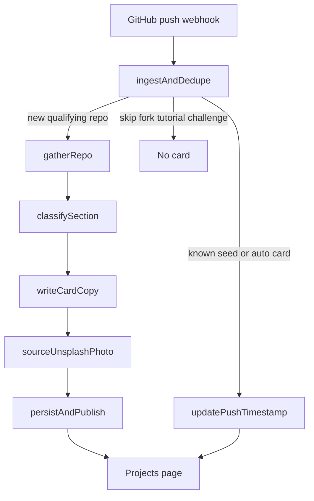

# Live Project Cards — Agentic Graph

Interview-explainable graph inside the existing Next.js app.
Not a chatbot glued to `/projects`. Not a Python LangGraph cluster.
No auth. No dashboard. Matches `docs/00_system_context.md`.

Trigger: GitHub `push` webhook (plus a one-time filtered backfill).



State is a typed `GraphState` object passed node to node in `lib/project-graph/`.

## What is locked

The current 7 cards in `data/projects.ts` are **seed cards**:

- Copy, section, tech chips, and `public/images/projects/*.jpg` are never rewritten
- The graph only overlays `lastPushedAt` and local **building now**
- Seed images are never replaced with Unsplash

## Skip list (ingest drops these)

Hard skip:

- Private repos
- Forks (`fastapi` and any other fork)
- Name or description looks like a template (`llm-chat-app-template`)
- The portfolio repo (`Personal-Portfolio`)
- Archived or empty (`size == 0`) repos

Name or description looks like practice/noise (case-insensitive):
`challenge`, `challenges`, `playground`, `demo-repo`, `tutorial`, `homework`, `practice`, `fundamental(s)`

Stay off the site: `python_challenges`, `javascript-playground`, `demo-repo`, `llm-chat-app-template`, `fastapi`.

GitHub’s `is_template` flag alone is **not** a skip. `llm-router` is original work that can get a card.

Can get a card if original: `Waitlist-API`, `Hijrah`, `AI-Memory-API`, `llm-router`.
Those land in **Systems** when they are not AI/ML. The Systems carousel renders only if at least one such card exists.

## Nodes

| Node | Responsibility |
|------|----------------|
| `ingestAndDedupe` | Skip rules. If slug/repo already exists, only refresh `lastPushedAt`. |
| `gatherRepo` | README, languages, topics, homepage, package.json / pyproject.toml, latest commit. |
| `classifySection` | `ai` \| `ml` \| `systems` from those signals (LLM + tight rubric). |
| `writeCardCopy` | Deen Dynamics voice: problem + who it helps. Chips filtered to the resume allowlist in code. Status starts as `active-development`. |
| `sourceUnsplashPhoto` | LLM proposes 1–2 concrete scene queries. GET Unsplash search. Landscape photo. Trigger Unsplash download endpoint. Hotlink CDN URL + photographer credit. Pexels if Unsplash is rate-limited. |
| `persistAndPublish` | Write card JSON to Redis. Page reads on next request. No git commit. |

## Live status (every public card)

- GitHub push → `lastPushedAt`
- Local CLI → **Building now** + branch, TTL ~20 minutes

CLI: `tools/local-sync/` watches folders, matches `QOOlajide/<repo>` remotes, `POST /api/activity` with `SYNC_SECRET`.

## Routes

| Route | Role |
|-------|------|
| `POST /api/github/webhook` | HMAC verify, enqueue graph via `after()` |
| `GET /api/projects` | Merge seed + auto cards + live overlay |
| `POST /api/projects/backfill` | One-time filtered backfill (`SYNC_SECRET`) |
| `POST /api/activity` | CLI heartbeats (`SYNC_SECRET`) |

`/projects` is a server page that reads Redis on each request (`force-dynamic`).

## Env

See `.env.example`. Required for the graph:

- `UPSTASH_REDIS_REST_URL` / `UPSTASH_REDIS_REST_TOKEN`
- `GITHUB_TOKEN`
- `GITHUB_WEBHOOK_SECRET`
- `SYNC_SECRET`
- `OPENAI_API_KEY`
- `UNSPLASH_ACCESS_KEY`
- `PEXELS_API_KEY` (optional fallback)

### How to get `GITHUB_WEBHOOK_SECRET` and `SYNC_SECRET`

Neither is issued by a vendor. You generate a random string, then paste the **same** value in two places.

Generate (do this twice — once per secret):

```bash
openssl rand -hex 32
```

**`GITHUB_WEBHOOK_SECRET`** — proves a POST really came from GitHub.

1. Put the generated string in Vercel → Project → Settings → Environment Variables as `GITHUB_WEBHOOK_SECRET` (Production + Preview). Redeploy after saving.
2. Add a webhook on **product repos**, not only `Personal-Portfolio`. A hook on the portfolio repo never creates cards: ingest skips `Personal-Portfolio`. Pushes to `voice-agent` (or any other qualifying repo) only reach the graph if that repo (or an account-wide GitHub App) has the hook.
3. For each public product repo: Settings → Webhooks → Add webhook. To cover the whole account, create a [GitHub App](https://github.com/settings/apps) installed on all (or selected) repos, subscribed to `push`.
4. Webhook fields:
   - Payload URL: `https://personal-portfolio-pearl-alpha-92.vercel.app/api/github/webhook`
   - Content type: `application/json`
   - Secret: the **same** string as `GITHUB_WEBHOOK_SECRET`
   - SSL: enabled
   - Events: **Just the push event**
5. GitHub will send a `ping`. A `200` with `{ ok: true, ping: true }` means the secret matches.

### Product-repo webhook checklist

A GitHub `push` is only the **event**. The card is Redis JSON written by `persistAndPublish`. If the webhook is missing on a product repo, that repo will never auto-create a card (use `POST /api/projects/backfill` once to catch up).

| Where the hook lives | What happens on push |
|---|---|
| Only `QOOlajide/Personal-Portfolio` | GitHub POSTs; ingest skips. No new cards. |
| Each product repo (`voice-agent`, …) | First qualifying push creates a card; later pushes set `lastPushedAt`. |
| GitHub App on the account, `push` | Same as per-repo hooks, without adding a hook to every new repo. |

This environment cannot open GitHub Settings. Confirm in the GitHub UI, or:

```bash
npm run verify:webhooks
```

That script only prints PASS/FAIL. It needs a token that can list repo hooks; 403 means add the hook in the UI (or an account GitHub App). Look for `config.url` ending in `/api/github/webhook` and `events` including `push`.

**`SYNC_SECRET`** — proves the local CLI and backfill curl are you. Not a GitHub token.

1. Put the second generated string in Vercel as `SYNC_SECRET`. Redeploy.
2. Put that same string in `~/.deen-sync.json` as `"secret"`.
3. Use it when you backfill:

```bash
curl -X POST https://personal-portfolio-pearl-alpha-92.vercel.app/api/projects/backfill \
  -H "Authorization: Bearer $SYNC_SECRET" \
  -H "Content-Type: application/json" \
  -d '{"all":true}'
```

Do **not** reuse `GITHUB_WEBHOOK_SECRET` as `SYNC_SECRET`. Do not commit either value.

**`GITHUB_TOKEN`** is different: that one you *do* get from GitHub.

1. [github.com/settings/tokens](https://github.com/settings/tokens) → Generate new token (classic) or a fine-grained token.
2. Classic: scope `public_repo` (read public repos, README, languages).
3. Fine-grained: Resource owner `QOOlajide`, read-only Contents + Metadata on public repos.
4. Paste as `GITHUB_TOKEN` on Vercel. This is for the graph to *read* repos, not for webhook HMAC.

## One-time setup

1. Upstash Redis on the existing Vercel project
2. Env vars above
3. GitHub `push` webhook on **product repos** (or a GitHub App on the account) → `https://<host>/api/github/webhook`. A hook only on `Personal-Portfolio` never creates cards.
4. Backfill qualifying public repos (noise stays out):

```bash
curl -X POST https://<host>/api/projects/backfill \
  -H "Authorization: Bearer $SYNC_SECRET" \
  -H "Content-Type: application/json" \
  -d '{"all":true}'
```

Or one repo at a time:

```bash
curl -X POST https://<host>/api/projects/backfill \
  -H "Authorization: Bearer $SYNC_SECRET" \
  -H "Content-Type: application/json" \
  -d '{"repo":"Waitlist-API"}'
```

5. Copy `tools/local-sync/deen-sync.example.json` to `~/.deen-sync.json` and run `npm run sync:local`

## Cards are Redis, not git

Nothing git-pushes a card. Publish is `persistAndPublish` writing JSON to Redis. The next `GET /projects` merges seven locked seeds from `data/projects.ts` with auto cards from Redis. A Vercel rebuild is not required for a new auto card. `git push` only matters as GitHub’s event that should hit `/api/github/webhook`.

If backfill returns `skipReason` starting with `generate-failed:`, ingest allowed the repo and a later node failed. The string names the node (`classify`, `copy`, `image`, `persist`, `gather`) and the error. Re-run `{ "repo": "voice-agent" }` after fixing that env/key.

## File map

**Doors (HTTP only — not the DAG)**

- `app/api/github/webhook/route.ts` — GitHub HMAC; `after(runProjectGraph)`
- `app/api/projects/backfill/route.ts` — `SYNC_SECRET`; same `runProjectGraph`. Catch-up only
- `app/api/activity/route.ts` — CLI heartbeat. Not a card
- `app/api/projects/route.ts` — JSON catalog for debugging

**Orchestrator**

- `lib/project-graph/run.ts` — ordered `await` + skip returns
- `lib/project-graph/fail.ts` — concrete `generate-failed:<node>:<detail>` for backfill JSON

**Nodes**

- `lib/project-graph/nodes/ingest.ts` + `skip.ts` — gates; no LLM
- `lib/project-graph/nodes/gather.ts` + `github.ts` — README, langs, homepage
- `lib/project-graph/nodes/classify.ts` + `llm.ts` — `ai|ml|systems`
- `lib/project-graph/nodes/copy.ts` + `data/tech-allowlist.ts` — title/copy/chips
- `lib/project-graph/nodes/image.ts` — Unsplash then Pexels
- `lib/project-graph/nodes/persist.ts` + `store.ts` + `lib/redis.ts` — **this is publish**

**Page**

- `data/projects.ts` — seven locked seeds
- `lib/project-graph/catalog.ts` — merge seeds + Redis + overlay
- `app/projects/page.tsx` — server fetch catalog
- `components/projects/project-card.tsx` — thumbnail; Unsplash credit if `photographer` set
